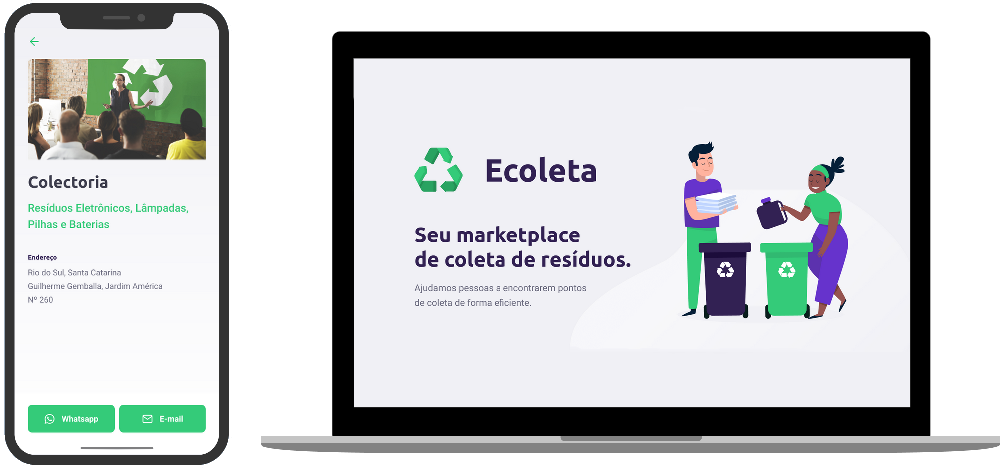

<h1 align="center">
    
</h1>

<h4 align="center"> 
	🚧 Aplicação em andamento... 🚧
</h4>

<p align="center">
  
  

  <a href="https://github.com/icaroov">
    
  </a>

  <a href="https://github.com/icaroov/ecoleta/commits/master">
    
  </a>

 </p> 

 ## 💻 Sobre o projeto

♻️ **Ecoleta** - é um marketplace que conecta empresas e pessoas ecologicamente responsáveis para ajudar na coleta de resíduos orgânicos e inorgânicos que geralmente são despejados na natureza ou queimados. É uma iniciativa gratuita que visa tornar pessoas e empresas mais conscientes.

## ⁉ Como funciona?

Empresas ou entidades poderão cadastrar-se na plataforma web enviando:
- uma imagem do ponto de coleta dos resíduos;
- nome da entidade, email e whatsapp;
- endereço da entidade;
- além de selecionar um ou mais ítens de coleta, que podem ser: lâmpadas, pilhas, baterias, papéis, papelão, resíduos eletrônicos, resíduos orgânicos e óleo de cozinha.

Os usuários terão acesso ao aplicativo móvel, onde poderão:
- navegar pelo mapa para ver as empresas cadastradas;
- entrar em contato através do e-mail ou whatsApp.

Projeto desenvolvido durante a **NLW - Next Level Week** oferecida pela **Rocketseat**.

## 🎨 Layout

Layout disponível no [Figma](https://www.figma.com/file/1SxgOMojOB2zYT0Mdk28lB/Ecoleta?node-id=136%3A546).

<p align="center">
  
</p>

## 🛠 Ferramentas

- [NodeJS](https://nodejs.org/en/)
- [ReactJS](https://reactjs.org/)
- [React Native](https://reactnative.dev/)
- [TypeScript](https://www.typescriptlang.org/)
- [KnexJS](http://knexjs.org/)
- [LeafletJS](https://leafletjs.com/)
- [React Leaflet](https://react-leaflet.js.org/)
- [Insomnia](https://insomnia.rest/)
- [SQLite](https://www.sqlite.org/docs.html)
- [SQLite Browser](https://sqlitebrowser.org/)
- [Expo](https://expo.io/)

## 🚀 Como rodar este projeto

Podemos considerar este projeto como sendo divido em três partes:
1. backend (pasta server) 
2. frontend (pasta web)
3. mobile (pasta mobile)

💡 O frontend e o mobile obrigatoriamente precisam que o backend seja executado.

### ⚙ Rodando o servidor (Back-end)

```bash
# Clone este repositório
$ git clone https://github.com/icaroov/ecoleta.git

# Acesse a pasta do projeto
$ cd ecoleta

# Vá para a pasta server
$ cd server

# Instale as dependências
$ npm install

# Execute a aplicação em modo de desenvolvimento
$ npm run dev

# O servidor inciará na porta:3333 - acesse http://localhost:3333
```

### 🎡 Rodando a aplicação web (Front-end)

```bash
# Clone este repositório
$ git clone https://github.com/icaroov/ecoleta.git

# Acesse a pasta do projeto
$ cd ecoleta

# Vá para a pasta da aplicação Front End
$ cd web

# Instale as dependências
$ npm install

# Execute a aplicação em modo de desenvolvimento
$ npm start

# A aplicação será aberta na porta:3000 - acesse http://localhost:3000
```

### 📱 Rodando a aplicação mobile 

🚧 Em construção... 🚧

## 🤔 Como contribuir para o projeto

1. Faça um **fork** do projeto.
2. Crie uma nova branch com as suas alterações: `git checkout -b my-feature`
3. Salve as alterações e crie uma mensagem de commit contando o que você fez: `git commit -m "feature: My new feature"`
4. Envie as suas alterações: `git push origin my-feature`
> Caso tenha alguma dúvida confira este [guia de como contribuir no GitHub](https://github.com/firstcontributions/first-contributions)

## ✨ Finalizando

Este projeto foi feito durante a **Next Level Week** em Junho de 2020, por **Ícaro Oliveira** 👋🏼 [Entre em contato!](https://www.linkedin.com/in/icaroov/)